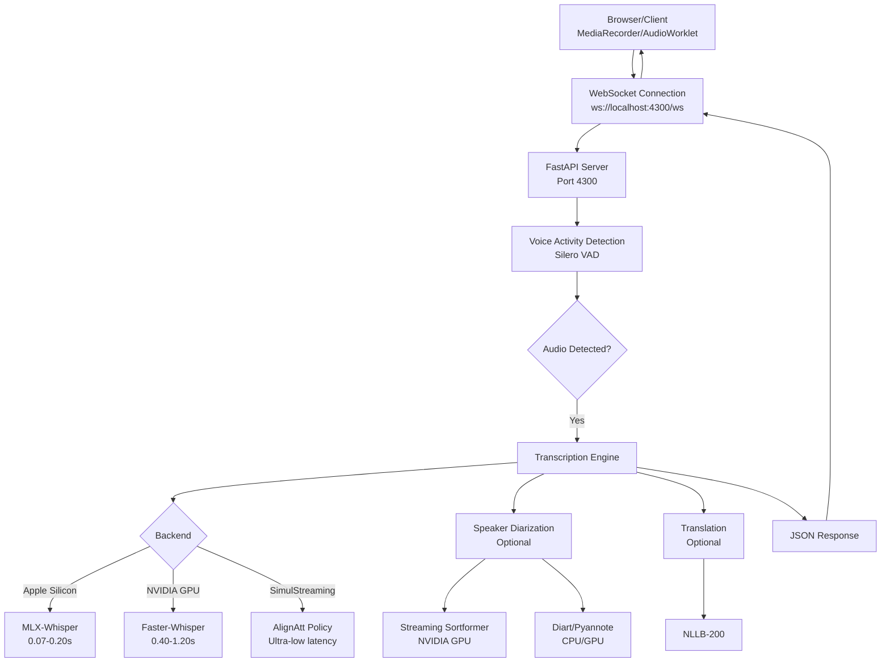

# Dudoxx Whisper STT - AI Context and Operational Manual

**Version:** 6.0.0  
**Date:** December 12, 2025  
**Author:** Walid Boudabbous, Founder and CTO of Dudoxx UG, CEO of Acceleate.com  
**Status:** EXPERIMENTAL - Self-Hosted Speech-to-Text

## Repo Policy

- Default branch: `main`
- This repository is used as a submodule of `dudoxx-hapifihr` (see `../.gitmodules`)

---

## 🚀 System Overview

Dudoxx Whisper STT is an ultra-low-latency, self-hosted speech-to-text service optimized for healthcare applications. Based on the excellent [WhisperLiveKit](https://github.com/QuentinFuxa/WhisperLiveKit) project, it provides real-time transcription using state-of-the-art SimulStreaming technology with HIPAA-compliant self-hosted deployment.

**Port:** 4300  
**Purpose:** Real-time medical transcription during patient consultations  
**Integration:** Dudoxx FHIR Clinic Platform

---

## 📊 Architecture Overview



---

## 🛠️ Technology Stack

### **Core Components**

| Component | Technology | Purpose |
|-----------|-----------|---------|
| **Server** | FastAPI + Uvicorn | High-performance async WebSocket server |
| **Transcription** | SimulStreaming (AlignAtt) | Ultra-low latency streaming ASR |
| **Models** | Whisper (tiny → large-v3-turbo) | OpenAI Whisper variants |
| **Backend (macOS)** | MLX-Whisper | Apple Silicon optimization (M1/M2/M3/M4) |
| **Backend (GPU)** | Faster-Whisper | NVIDIA GPU acceleration |
| **VAD** | Silero VAD | Voice Activity Detection (noise filtering) |
| **Diarization** | Streaming Sortformer / Diart | Speaker identification |
| **Translation** | NLLB-200 | Neural machine translation (99 languages) |

### **Performance Characteristics**

| Backend | Encoder Time (base.en) | Encoder Time (small) | Memory Footprint |
|---------|------------------------|----------------------|------------------|
| MLX-Whisper (M4) | 0.07s | 0.20s | ~150MB (encoder only) |
| Faster-Whisper | 0.40s | 1.20s | ~500MB |
| Standard Whisper | 0.35s | 1.09s | ~600MB |

**Key Insight:** MLX-Whisper on Apple Silicon is **5-6x faster** than standard backends, making it ideal for real-time transcription.

---

## 📁 Project Structure

```
ddx-ai-whisper/
├── whisperlivekit/                    # Core library
│   ├── basic_server.py                # FastAPI WebSocket server
│   ├── audio_processor.py             # Audio processing pipeline
│   ├── core.py                        # Core transcription logic
│   ├── simul_whisper/                 # SimulStreaming implementation
│   │   ├── backend.py                 # Backend abstraction (MLX/Faster)
│   │   ├── config.py                  # SimulStreaming configuration
│   │   └── mlx_encoder.py             # Apple Silicon encoder
│   ├── diarization/                   # Speaker identification
│   │   ├── sortformer/                # Streaming Sortformer (NVIDIA)
│   │   └── diart/                     # Pyannote-based diarization
│   ├── whisper/                       # Whisper model handling
│   ├── local_agreement/               # LocalAgreement policy (legacy)
│   ├── ffmpeg_manager.py              # Audio format conversion
│   ├── timed_objects.py               # Timestamp management
│   └── web/                           # Web demo UI
├── faster-whisper/                    # Standalone faster-whisper server
│   ├── streaming_server.py            # Alternative lightweight server
│   ├── config/.env.example            # Faster-whisper configuration
│   └── systemd/                       # Production systemd service
├── chrome-extension/                  # Browser extension for recording
├── frontend/                          # Demo web interface
├── scripts/                           # Utility scripts
├── docs/                              # Documentation
│   ├── API.md                         # WebSocket API reference
│   ├── supported_languages.md         # 99 supported languages
│   ├── technical_integration.md       # Integration guide
│   └── troubleshooting.md             # Common issues and fixes
├── .env.example                       # Environment configuration template
├── pyproject.toml                     # Package configuration
└── README.md                          # Quick start guide
```

---

## ⚙️ Configuration

### **Environment Variables (.env)**

```bash
# =============================================================================
# Server Configuration
# =============================================================================
STT_PORT=4300                          # Port for the STT server
STT_HOST=localhost                     # Host to bind the server to
LOG_LEVEL=INFO                         # DEBUG, INFO, WARNING, ERROR, CRITICAL

# =============================================================================
# Whisper Model Configuration
# =============================================================================
WHISPER_MODEL=large-v3-turbo           # tiny, base, small, medium, large-v3-turbo
WHISPER_BACKEND=mlx-whisper            # auto, mlx-whisper, faster-whisper, whisper
DEFAULT_LANGUAGE=auto                  # auto, en, fr, de, etc.

# =============================================================================
# Performance Tuning
# =============================================================================
BACKEND_POLICY=simulstreaming          # simulstreaming (AlignAtt) or localagreement
MIN_CHUNK_SIZE=0.1                     # Minimum chunk size in seconds
BUFFER_TRIMMING=segment                # segment or sentence
BUFFER_TRIMMING_SEC=15                 # Buffer trimming threshold

# =============================================================================
# Diarization Configuration (Optional)
# =============================================================================
DIARIZATION_ENABLED=false              # Enable speaker identification
DIARIZATION_BACKEND=diart              # sortformer (NVIDIA) or diart (CPU/GPU)
HF_TOKEN=your_huggingface_token        # Required for pyannote models
SEGMENTATION_MODEL=pyannote/segmentation-3.0
EMBEDDING_MODEL=pyannote/embedding

# =============================================================================
# Voice Activity Detection
# =============================================================================
VAD_ENABLED=true                       # Enable VAD to filter silence
VAC_ENABLED=true                       # Voice Activity Controller for chunking
VAC_CHUNK_SIZE=0.04                    # VAC chunk size in seconds

# =============================================================================
# Translation (Optional)
# =============================================================================
TARGET_LANGUAGE=                       # Leave empty to disable (en, fr, de, etc.)
DIRECT_ENGLISH_TRANSLATION=false       # Use Whisper's built-in translation
NLLB_BACKEND=transformers              # transformers or ctranslate2
NLLB_SIZE=600M                         # 600M or 1.3B

# =============================================================================
# Advanced Configuration
# =============================================================================
AUDIO_MAX_LEN=30.0                     # Maximum audio buffer length (seconds)
AUDIO_MIN_LEN=0.0                      # Minimum audio length before processing
BEAMS=1                                # Number of beams for beam search
DECODER_TYPE=greedy                    # greedy or beam
FRAME_THRESHOLD=25                     # Frame threshold for attention-guided decoding
INIT_PROMPT=                           # Initial prompt for domain-specific vocabulary
STATIC_INIT_PROMPT=                    # Static prompt (persists across segments)

# =============================================================================
# SSL Configuration (Production)
# =============================================================================
SSL_CERTFILE=                          # Path to SSL certificate
SSL_KEYFILE=                           # Path to SSL key
FORWARDED_ALLOW_IPS=                   # IPs allowed for reverse proxy

# =============================================================================
# Audio Input Configuration
# =============================================================================
PCM_INPUT=false                        # Use raw PCM input (AudioWorklet)
```

### **Model Selection Guide**

| Model | Size | VRAM | Speed | Quality | Use Case |
|-------|------|------|-------|---------|----------|
| **tiny** | 39M | ~150MB | Fastest | Basic | Quick testing, low-resource |
| **base** | 74M | ~200MB | Very fast | Good | Real-time mobile apps |
| **small** | 244M | ~500MB | Fast | Better | Desktop apps, conferencing |
| **medium** | 769M | ~1.5GB | Moderate | High | Medical transcription |
| **large-v3** | 1550M | ~3GB | Slower | Excellent | Production, archive |
| **large-v3-turbo** | 809M | ~1.5GB | Fast | Excellent | **RECOMMENDED** |

**Recommendation:** Use `large-v3-turbo` for best balance of speed and quality.

---

## 🚀 Running the System

### **Development Mode (WhisperLiveKit)**

```bash
# 1. Create virtual environment
cd ddx-ai-whisper
python3 -m venv venv
source venv/bin/activate

# 2. Install dependencies
pip install -e .

# 3. Install MLX-Whisper (macOS Apple Silicon)
pip install mlx-whisper

# 4. Configure environment
cp .env.example .env
nano .env  # Set your configuration

# 5. Start the server
dudoxx-stt --model large-v3-turbo --language en --port 4300

# Alternative: Start with diarization
dudoxx-stt --model medium --language en --port 4300 --diarization --backend mlx-whisper
```

### **Development Mode (Faster-Whisper Server)**

```bash
# 1. Navigate to faster-whisper directory
cd ddx-ai-whisper/faster-whisper

# 2. Create virtual environment
python3.11 -m venv venv
source venv/bin/activate

# 3. Install dependencies
pip install -r requirements.txt

# 4. Configure environment
cp config/.env.example .env
nano .env  # Set HF_TOKEN and other settings

# 5. Run the server
./start.sh
```

### **Production Deployment (Systemd)**

```bash
# 1. Copy systemd service file
sudo cp faster-whisper/systemd/faster-whisper.service /etc/systemd/system/

# 2. Edit service to match your installation paths
sudo nano /etc/systemd/system/faster-whisper.service

# 3. Enable and start the service
sudo systemctl daemon-reload
sudo systemctl enable faster-whisper
sudo systemctl start faster-whisper

# 4. Check status
sudo systemctl status faster-whisper

# 5. View logs
sudo journalctl -u faster-whisper -f
```

### **Docker Deployment**

```bash
# CPU-only deployment
docker build -f Dockerfile.cpu -t ddx-ai-whisper .
docker run -p 4300:8000 --name dudoxx-stt ddx-ai-whisper --model large-v3-turbo --language en

# GPU deployment (NVIDIA)
docker build -t ddx-ai-whisper .
docker run --gpus all -p 4300:8000 --name dudoxx-stt ddx-ai-whisper --model large-v3-turbo --language en
```

---

## 🔌 API Reference

### **WebSocket Endpoint**

```
ws://localhost:4300/ws?language=auto
```

**Query Parameters:**
- `language` (optional): Source language code (`en`, `fr`, `de`, `auto`)

### **Legacy API Response Format**

```typescript
interface TranscriptionResponse {
  type: string;                        // "transcript_update"
  status: string;                      // "active_transcription" | "no_audio_detected"
  lines: Array<{
    speaker: number;                   // Speaker ID (1, 2, 3...)
    text: string;                      // Transcribed text
    start: number;                     // Start timestamp (seconds)
    end: number;                       // End timestamp (seconds)
    translation: string | null;        // Translation (if enabled)
    detected_language: string;         // ISO language code
  }>;
  buffer_transcription: string;        // Unvalidated text
  buffer_diarization: string;          // Text waiting for speaker assignment
  remaining_time_transcription: number;// Audio queue time (seconds)
  remaining_time_diarization: number;  // Diarization queue time (seconds)
}
```

### **New API Response Format (Under Development)**

```typescript
interface NewTranscriptionResponse {
  type: "transcript_update";
  status: "active_transcription" | "no_audio_detected";
  segments: Array<{
    id: number;                        // Unique segment ID
    speaker: number;                   // Speaker ID (-2 for silence)
    text: string;                      // Validated text (append to segment)
    start_speaker: number;             // Speaker segment start time
    start: number;                     // First word start time
    end: number;                       // Last word end time
    language: string | null;           // ISO language code
    translation: string;               // Validated translation (append)
    words: Array<{
      text: string;
      start: number;
      end: number;
      validated: {
        text: boolean;                 // Transcription validated
        speaker: boolean;              // Speaker validated
      };
    }>;
    buffer: {
      transcription: string;           // Ephemeral pending text
      diarization: string;             // Ephemeral pending speaker assignment
      translation: string;             // Ephemeral pending translation
    };
  }>;
  metadata: {
    remaining_time_transcription: number;
    remaining_time_diarization: number;
  };
}
```

**Key Differences:**
- **Incremental Updates**: Only changed/new segments are sent
- **Per-Segment Buffers**: Ephemeral data displayed immediately but overwritten
- **Word-Level Timestamps**: Fine-grained timing information
- **Validation Flags**: Distinguish validated vs. pending text

---

## 🎯 Integration with Dudoxx Platform

### **Port Allocation**

| Service | Port | Purpose |
|---------|------|---------|
| Next.js Frontend | 4000 | Main clinic UI |
| NestJS Backend | 4100 | API and business logic |
| Calendar Microservice | 4200 | Appointment scheduling |
| **Dudoxx Whisper STT** | **4300** | **Real-time transcription** |
| Patient Intake Assistant | 4400 | AI patient intake |
| LiveKit Voice Agent | 4500 | Voice AI conversations |
| Kokoro TTS | 4600 | Text-to-speech |
| HAPI FHIR Server | 8080 | FHIR resource storage |
| Jitsi Meet | 8543 | Video conferencing (HTTPS) |

### **Use Cases**

1. **Medical Transcription During Consultations**
   - Real-time transcription of doctor-patient conversations
   - SOAP notes generation
   - Clinical documentation automation

2. **Video Call Captioning (Jitsi Integration)**
   - Live captions for video consultations
   - Accessibility for hearing-impaired patients
   - Meeting transcripts for record-keeping

3. **Voice-to-FHIR Data Extraction (Future)**
   - Extract structured data from voice input
   - Populate FHIR resources (Observation, Condition, Procedure)
   - Voice-driven clinical data entry

### **Next.js Integration Example**

```typescript
// hooks/useWhisperSTT.ts
'use client';

import { useState, useCallback, useRef } from 'react';

interface UseWhisperSTTOptions {
  serverUrl?: string;  // Default: ws://localhost:4300/ws
  language?: string;   // Default: 'auto'
  onTranscript?: (data: any) => void;
  onError?: (error: Error) => void;
}

export function useWhisperSTT({
  serverUrl = 'ws://localhost:4300/ws',
  language = 'auto',
  onTranscript,
  onError,
}: UseWhisperSTTOptions = {}) {
  const [isConnected, setIsConnected] = useState(false);
  const [isRecording, setIsRecording] = useState(false);
  const [transcript, setTranscript] = useState('');
  
  const wsRef = useRef<WebSocket | null>(null);
  const mediaRecorderRef = useRef<MediaRecorder | null>(null);

  const connect = useCallback(() => {
    const wsUrl = `${serverUrl}?language=${language}`;
    wsRef.current = new WebSocket(wsUrl);

    wsRef.current.onopen = () => setIsConnected(true);
    
    wsRef.current.onmessage = (event) => {
      const data = JSON.parse(event.data);
      
      // Legacy API: concatenate all lines
      const fullText = data.lines?.map((l: any) => l.text).join(' ') || '';
      setTranscript(fullText);
      
      onTranscript?.(data);
    };

    wsRef.current.onerror = () => {
      onError?.(new Error('WebSocket connection failed'));
    };

    wsRef.current.onclose = () => {
      setIsConnected(false);
      setIsRecording(false);
    };
  }, [serverUrl, language, onTranscript, onError]);

  const startRecording = useCallback(async () => {
    if (!wsRef.current || isRecording) return;

    try {
      const stream = await navigator.mediaDevices.getUserMedia({
        audio: {
          sampleRate: 16000,
          channelCount: 1,
          echoCancellation: true,
          noiseSuppression: true,
        },
      });

      const mediaRecorder = new MediaRecorder(stream, {
        mimeType: 'audio/webm',
      });

      mediaRecorder.ondataavailable = (event) => {
        if (event.data.size > 0 && wsRef.current?.readyState === WebSocket.OPEN) {
          wsRef.current.send(event.data);
        }
      };

      mediaRecorder.start(100);  // Send chunks every 100ms
      mediaRecorderRef.current = mediaRecorder;
      setIsRecording(true);
      setTranscript('');

    } catch (err) {
      onError?.(err as Error);
    }
  }, [isRecording, onError]);

  const stopRecording = useCallback(() => {
    if (mediaRecorderRef.current && isRecording) {
      mediaRecorderRef.current.stop();
      mediaRecorderRef.current.stream.getTracks().forEach(track => track.stop());
      mediaRecorderRef.current = null;
      setIsRecording(false);
    }
  }, [isRecording]);

  const disconnect = useCallback(() => {
    stopRecording();
    if (wsRef.current) {
      wsRef.current.close();
      wsRef.current = null;
    }
  }, [stopRecording]);

  return {
    connect,
    disconnect,
    startRecording,
    stopRecording,
    isConnected,
    isRecording,
    transcript,
  };
}
```

**Usage in Component:**

```typescript
// components/MedicalTranscriber.tsx
'use client';

import { useWhisperSTT } from '@/hooks/useWhisperSTT';

export function MedicalTranscriber() {
  const { connect, disconnect, startRecording, stopRecording, isConnected, isRecording, transcript } = useWhisperSTT({
    serverUrl: 'ws://localhost:4300/ws',
    language: 'en',
    onTranscript: (data) => {
      console.log('Received transcript:', data);
      // Save to FHIR DocumentReference
    },
  });

  return (
    <div className="flex flex-col gap-4 p-4">
      <div className="flex gap-2">
        {!isConnected ? (
          <button onClick={connect} className="px-4 py-2 bg-primary text-primary-foreground rounded">
            Connect to STT
          </button>
        ) : !isRecording ? (
          <button onClick={startRecording} className="px-4 py-2 bg-green-600 text-white rounded">
            Start Recording
          </button>
        ) : (
          <button onClick={stopRecording} className="px-4 py-2 bg-red-600 text-white rounded">
            Stop Recording
          </button>
        )}
      </div>
      
      <div className="min-h-48 p-4 bg-muted rounded-lg">
        <p className="text-sm text-muted-foreground mb-2">Live Transcript:</p>
        <p className="text-base">{transcript || 'No speech detected...'}</p>
      </div>
    </div>
  );
}
```

---

## 🔧 Advanced Features

### **1. Speaker Diarization**

Identifies different speakers in multi-speaker scenarios (e.g., doctor-patient conversations).

**Backends:**
- **Streaming Sortformer** (NVIDIA GPU): State-of-the-art 2025, best quality
- **Diart/Pyannote** (CPU/GPU): Works on any hardware, requires HuggingFace token

**Configuration:**
```bash
DIARIZATION_ENABLED=true
DIARIZATION_BACKEND=diart  # or sortformer
HF_TOKEN=your_huggingface_token
```

**Response Format:**
```json
{
  "lines": [
    {
      "speaker": 1,
      "text": "How are you feeling today?",
      "start": 0.0,
      "end": 2.5
    },
    {
      "speaker": 2,
      "text": "I've been having headaches for the past week.",
      "start": 3.0,
      "end": 6.2
    }
  ]
}
```

### **2. Translation**

Real-time translation to target language using NLLB-200 model.

**Configuration:**
```bash
TARGET_LANGUAGE=fr           # Translate to French
NLLB_BACKEND=transformers    # transformers or ctranslate2
NLLB_SIZE=600M               # 600M (faster) or 1.3B (better quality)
```

**Performance (MacBook M3):**
- **Transformers**: 0.72-0.88s per translation
- **CTranslate2**: 1.36-2.05s per translation (slower on M3)

**Recommendation:** Use `transformers` backend on Apple Silicon.

### **3. Apple Silicon Optimization (MLX-Whisper)**

**Memory Savings:**
- **Encoder-only loading**: ~15MB (vs. ~75MB for full model)
- **Total memory**: ~150MB (tiny.en) vs. ~600MB (standard Whisper)

**Speed Improvements:**
- **5-6x faster** than standard Whisper on M1/M2/M3/M4
- **Base model**: 0.07s encoder time (vs. 0.35s standard)
- **Small model**: 0.20s encoder time (vs. 1.09s standard)

**Installation:**
```bash
pip install mlx-whisper
```

**Configuration:**
```bash
WHISPER_BACKEND=mlx-whisper
```

### **4. Custom Vocabulary and Prompts**

**Initial Prompt** (domain-specific vocabulary):
```bash
INIT_PROMPT="Medical consultation: patient, diagnosis, symptoms, treatment"
```

**Static Prompt** (persists across segments):
```bash
STATIC_INIT_PROMPT="Doctor-patient conversation in clinic setting"
```

**Hotwords (Faster-Whisper Server):**
```bash
HOTWORDS=Dudoxx,Walid Boudabbous,Hamburg,Tomedo,Odoo,FHIR
```

---

## 📊 Performance Tuning

### **Latency Optimization**

| Parameter | Impact | Recommendation |
|-----------|--------|----------------|
| `BACKEND_POLICY` | Streaming strategy | `simulstreaming` (lowest latency) |
| `MIN_CHUNK_SIZE` | Minimum processing unit | `0.1` (100ms, balance quality/speed) |
| `VAD_ENABLED` | Filter silence | `true` (reduces processing) |
| `BUFFER_TRIMMING` | Memory management | `segment` (efficient) |
| `WHISPER_MODEL` | Quality vs. speed | `large-v3-turbo` (best balance) |
| `WHISPER_BACKEND` | Hardware acceleration | `mlx-whisper` (Apple) or `faster-whisper` (NVIDIA) |

### **Memory Optimization**

| Configuration | VRAM Usage | CPU RAM |
|--------------|------------|---------|
| `tiny + mlx-whisper` | ~150MB | ~500MB |
| `base + mlx-whisper` | ~200MB | ~800MB |
| `small + mlx-whisper` | ~500MB | ~1.5GB |
| `medium + faster-whisper` | ~1.5GB | ~2GB |
| `large-v3 + faster-whisper` | ~3GB | ~4GB |
| `large-v3-turbo + faster-whisper` | ~1.5GB | ~3GB |

**Recommendation:** Use `large-v3-turbo + mlx-whisper` on Apple Silicon for best performance.

---

## 🧪 Testing & Verification

### **Quick Test (Browser Console)**

```javascript
// Connect to WebSocket
const ws = new WebSocket('ws://localhost:4300/ws?language=en');

ws.onopen = () => console.log('Connected to Whisper STT');

ws.onmessage = (event) => {
  const data = JSON.parse(event.data);
  console.log('Transcript:', data);
};

ws.onerror = (error) => console.error('WebSocket error:', error);

ws.onclose = () => console.log('Disconnected from Whisper STT');

// To send audio, use MediaRecorder API
navigator.mediaDevices.getUserMedia({ audio: true })
  .then(stream => {
    const mediaRecorder = new MediaRecorder(stream);
    mediaRecorder.ondataavailable = (event) => {
      if (ws.readyState === WebSocket.OPEN) {
        ws.send(event.data);
      }
    };
    mediaRecorder.start(100);  // Send chunks every 100ms
  });
```

### **Health Checks**

1. **Server Status**: `curl http://localhost:4300/health` (if health endpoint exists)
2. **WebSocket Connection**: Browser DevTools → Network → WS
3. **Model Loading**: Check server logs for model initialization
4. **Transcription Quality**: Test with known audio samples

### **Performance Benchmarks**

```bash
# Run benchmarks with different models
dudoxx-stt --model tiny --language en --port 4300 &
# Send test audio and measure latency

dudoxx-stt --model large-v3-turbo --language en --port 4300 &
# Compare latency and quality
```

---

## 🐛 Troubleshooting

### **Common Issues**

#### **1. WebSocket Connection Failed**

**Symptoms:** Frontend cannot connect to `ws://localhost:4300/ws`

**Solutions:**
- Check server is running: `ps aux | grep dudoxx-stt`
- Verify port is correct: `netstat -an | grep 4300`
- Check firewall rules
- Ensure no reverse proxy blocking WebSocket upgrades

#### **2. Model Download Errors**

**Symptoms:** "Could not download model" or "Connection timeout"

**Solutions:**
```bash
# Pre-download models
python -c "import whisper; whisper.load_model('large-v3-turbo')"

# Or set cache directory
export HF_HOME=/path/to/models
export TRANSFORMERS_CACHE=/path/to/models
```

#### **3. High Latency / Slow Transcription**

**Symptoms:** >2 second delays, choppy audio

**Solutions:**
- Use smaller model: `WHISPER_MODEL=base`
- Enable MLX on Apple Silicon: `WHISPER_BACKEND=mlx-whisper`
- Reduce chunk size: `MIN_CHUNK_SIZE=0.05`
- Disable diarization: `DIARIZATION_ENABLED=false`
- Increase `VAC_CHUNK_SIZE` to `0.1`

#### **4. Poor Transcription Quality**

**Symptoms:** Incorrect words, missing text

**Solutions:**
- Use larger model: `WHISPER_MODEL=large-v3-turbo`
- Specify language: `language=en` (instead of `auto`)
- Add domain prompt: `INIT_PROMPT="Medical consultation"`
- Check audio quality: 16kHz, mono, no background noise

#### **5. Speaker Diarization Not Working**

**Symptoms:** All text attributed to same speaker

**Solutions:**
- Verify HuggingFace token: `HF_TOKEN=hf_...`
- Check model access: Accept terms on [pyannote/segmentation-3.0](https://huggingface.co/pyannote/segmentation-3.0)
- Use `diart` backend on CPU/GPU
- Ensure sufficient VRAM (1.5GB+ for diarization)

#### **6. Memory Errors / OOM**

**Symptoms:** "Out of memory" crashes

**Solutions:**
- Use smaller model: `WHISPER_MODEL=small`
- Use INT8 quantization (Faster-Whisper): `WHISPER_COMPUTE_TYPE=int8`
- Disable diarization: `DIARIZATION_ENABLED=false`
- Reduce buffer: `BUFFER_TRIMMING_SEC=10`

---

## 🔒 Security & Privacy

### **HIPAA Compliance**

✅ **Self-Hosted**: All audio processing on-premises, no cloud API calls  
✅ **No Data Retention**: Audio not stored unless explicitly configured  
✅ **Encrypted Transport**: Use WSS (WebSocket Secure) in production  
✅ **Access Control**: Implement authentication before WebSocket upgrade  

### **Production Deployment**

```bash
# Enable SSL/TLS
SSL_CERTFILE=/etc/ssl/certs/ddx-whisper.crt
SSL_KEYFILE=/etc/ssl/private/ddx-whisper.key

# Start with HTTPS
dudoxx-stt --model large-v3-turbo --port 4300 --ssl-certfile $SSL_CERTFILE --ssl-keyfile $SSL_KEYFILE
```

### **Authentication (Example)**

```python
# Custom authentication middleware
from fastapi import WebSocket, HTTPException, status

async def authenticate_websocket(websocket: WebSocket):
    token = websocket.query_params.get("token")
    if not verify_jwt(token):
        await websocket.close(code=status.WS_1008_POLICY_VIOLATION)
        raise HTTPException(status_code=401, detail="Invalid token")
```

---

## 📈 Future Roadmap

### **Planned Features**

- [ ] **Voice-to-FHIR Extraction**: Structured data extraction from voice
- [ ] **Multi-language Diarization**: Speaker identification in multiple languages
- [ ] **Custom Medical Vocabulary**: Pre-trained medical terminology
- [ ] **Integration with ddx-api**: Direct FHIR resource creation
- [ ] **Real-time SOAP Notes**: Automatic clinical note generation
- [ ] **Encounter Summarization**: AI-generated consultation summaries
- [ ] **ICD-10 / SNOMED Coding**: Automatic medical coding from transcripts

### **Research Integration**

Based on state-of-the-art research:
- **SimulStreaming** (2025): Ultra-low latency with AlignAtt policy
- **WhisperStreaming** (2023): LocalAgreement policy
- **Streaming Sortformer** (2025): Real-time speaker diarization
- **Silero VAD** (2024): Voice Activity Detection

---

## 📞 Support & Contact

**Company:** Dudoxx UG, Hamburg, Germany  
**Founder & CTO:** Walid Boudabbous  
**CEO:** Acceleate.com  
**Email:** support@dudoxx.com  
**Status:** Experimental (Healthcare Production Evaluation)

### **Resources**

- **Original Project**: [WhisperLiveKit](https://github.com/QuentinFuxa/WhisperLiveKit)
- **Whisper Models**: [OpenAI Whisper](https://github.com/openai/whisper)
- **MLX-Whisper**: [Apple MLX-Whisper](https://github.com/ml-explore/mlx-examples/tree/main/whisper)
- **Faster-Whisper**: [SYSTRAN faster-whisper](https://github.com/SYSTRAN/faster-whisper)

---

## 📄 Related Documentation

- **INSTALL.md** - Installation guide with step-by-step instructions
- **IMPORTANT.md** - Critical paths and performance optimization
- **docs/API.md** - Detailed WebSocket API reference
- **docs/supported_languages.md** - Full list of 99 supported languages
- **docs/technical_integration.md** - Integration patterns
- **docs/troubleshooting.md** - Common issues and solutions

---

**Note**: This documentation represents a self-hosted, HIPAA-compliant speech-to-text system optimized for healthcare applications, providing real-time transcription with state-of-the-art accuracy and ultra-low latency.
